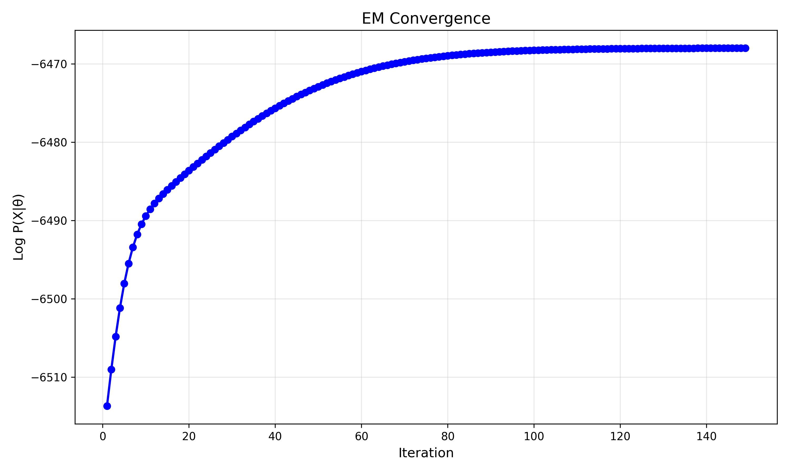
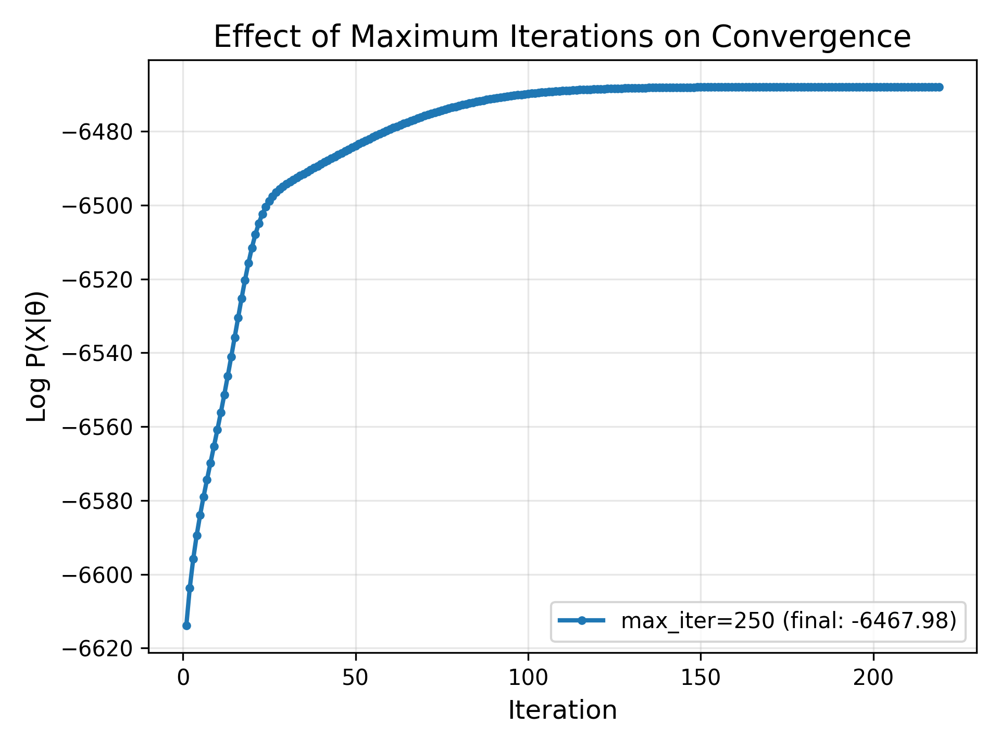
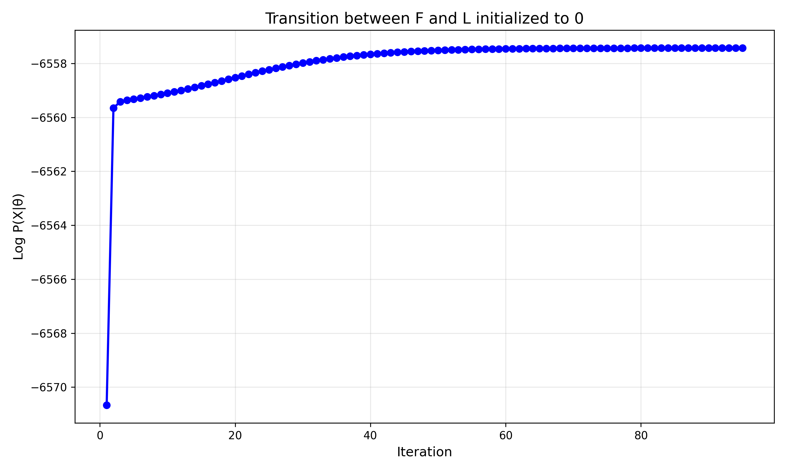
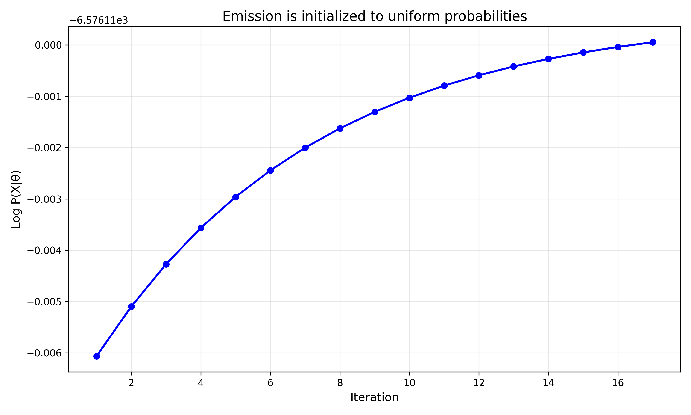

# חלק 1

## שאלה 1
הסתברויות הפליטה של כל מטבע בכל מצב חבוי הן:

* F | H -> 0.49920445
* F | T -> 0.50079555
* L | H -> 0.92330427
* L | T -> 0.07669573

ההסתברויות שקיבלנו עבור מטבע הוגן הגיוניות, כיוון שהן מייצגות את העובדה שההסתברות לראות H שווה להסתברות לראות T.
המטבע המוטה מוטה בבירור לכיוון H, שכן ההסתברות לקבל H גבוהה משמעותית מההסתברות לקבל T.

## שאלה 2
הסתברויות המעבר של מטבע בין המצבים החבויים הן:

* F -> F: 0.90337949
* F -> L: 0.09662051
* L -> F: 0.22271111
* L -> L: 0.77728889

ההסתברויות שקיבלנו הגיוניות משום שהמעבר בין מצבים זהים הוא מאוד סביר, ועל כן קיבלנו הסתברות גבוהה לכך.
המעברים בין שני מצבים שונים פחות סבירים, ואכן קיבלנו עבורם הסתברויות יותר נמוכות.

## שאלה 3

הגרף שקיבלנו הגיוני, כיוון שניתן לראות באופן ברור כי:

1. הlikelihood עולה ככל שמספר האיטרציות גדל
2. בשלב מסוים (מהאיטרציה ה100 בערך) ניתן לראות שהפו' מתכנסת, והשינוי בlikelihood קטן מאוד

שתי התובנות הללו מתאימות בדיוק לתיאור האלגוריתם.

## שאלה 4

שינינו את מס' האיטרציות המקסימלי להיות 250 איטרציות. בנוסף, הגדרנו tolerance של $1e-4$.
כפי שניתן לראות בגרף, הריצה נעצרה לאחר 219 איטרציות, כיוון שבאיטרציה האחרונה השינוי היה קטן מאותו tolerance שהגדרנו. כלומר, ככל שמס' האיטרציות המקסימלי עולה אכן הנראות משתפרת, אך בשלב מסוים היא משתפרת בקצב קטן מאוד.

## שאלה 5

אתחלנו את המעבר בין F ל - L במטריצת המעברים לאפס. כתוצאה מכך, לפי מה שלמדנו בכיתה, נצפה שבמטריצת המעברים הנלמדת המעבר הנ"ל יישאר 0.
לאחר ההרצה, המעבר אכן נשאר בהסתברות 0, כפי שציפינו. בנוסף, הבחנו כי הlikelihood המקסימלי שהושג באתחול זה, נמוך משמעותית מזה שהושג באתחול רנדומי. ברצפים שלנו, המעבר בין F ל - L הוא אפשרי, ולכן כאשר אנו מגדירים אותו ל - 0, בהכרח נקטין את הlikelihood שהאלגוריתם יכול להשיג.

אתחלנו את מטריצת הפליטה בהסתברות אחידה (0.5 בכל הערכים). כתוצאה מכך, במטריצת הפליטה הנלמדת קיבלנו שבהינתן תצפית כלשהי, ההסתברות לקבל כל מצב חבוי זהה. כלומר, במקרה שלנו:
$P(F | H) = P(L | H), P(F | T) = P(L | T)$

בנוסף, הבחנו שגם במקרה הזה, הlikelihood מתכנס לערך קטן משמעותית מזה שהושג באחתול רנדומי.
כאן גם אפשר להבחין שהlikelihood מתכנס בצורה מהירה משמעותית (אחרי 17 איטרציות בגרף). זאת כיוון שבעקבות האתחול היוניפורמי, האלגוריתם ילמד רק את מספר הפעמים שהתצפית נראתה מתוך כל הרצף, וזוהי תהיה הסתברות הפליטה בכל המצבים עבור תצפית זו. זהו תהליך יותר פשוט, ולכן גם יותר מהיר.